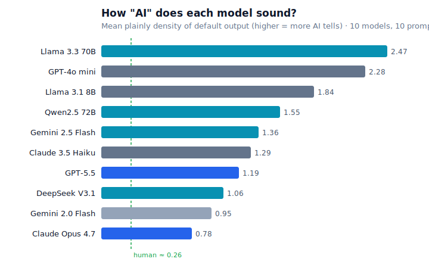
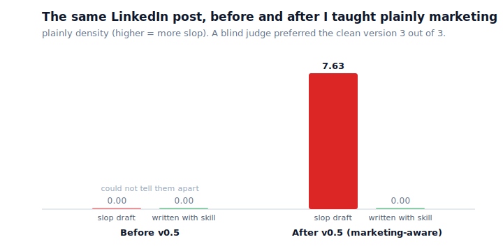

# plainly

My AI first drafts all had a tell. The same few words (delve, robust, leverage), the
"it's not just X, it's Y" reflex, the tidy list of three. I got tired of deleting it by
hand, so I wrote plainly.

It's a Claude Code plugin. It scores non-fiction prose for the habits that make it read
as machine-written, and offers to fix them. It is not an AI detector and I don't pitch it
as one. These are just bad writing habits, whoever has them. Works on essays, docs, blog
posts, marketing copy. Python 3.11+, no dependencies.

## Install

```bash
claude plugin marketplace add Mapika/plainly
claude plugin install plainly@plainly
```

That gives you the `/plainly:check` command, the `deslopper` agent, and a writing skill.
To run the engine on a file without the plugin:

```bash
python3 plainly/scripts/prescan.py draft.md
```

## Using it

**It watches on its own.** A hook runs after Claude writes or edits any `.md`, `.txt`, or
`.rst` file. If the result reads AI-generated, plainly says so and offers to clean it.
Clean prose and code get no comment. Tune or switch it off in `.plainly.toml`.

**`/plainly:check draft.md`** prints findings by severity, each with the line, the bad
span, a reason, and a rewrite. It reads the file. It never edits.

```bash
python3 plainly/scripts/prescan.py draft.md --json   # the raw scan
```

`density` is the number to watch: tell-weight per 100 words. Human prose sits near 0.
Slop runs into the teens.

**The `deslopper` agent** edits the flagged spans and hands the text back. Just say
"deslop draft.md". Two things matter here. It works a paragraph at a time and reverts any
edit that adds a new tell, fails to lower the score, or flattens the rhythm, so the text
can't come out worse than it went in. And it finishes with a before/after scorecard plus a
blind judge: a cheap subagent that reads both versions in random order and picks the more
human one without seeing the scores. It only claims a win when both agree.

**The `writing-clean-prose` skill** loads itself when Claude writes prose for you, so the
tells don't show up to begin with.

**In CI:**

```bash
python3 plainly/scripts/prescan.py --diff --fail-over 4   # fail if a changed .md scores over 4
```

## Config

Drop a `.plainly.toml` in your repo root.

| Section | Key | Meaning |
|---|---|---|
| `[severity]` | `critical`, `moderate` | Cluster weight per paragraph to reach each tier. |
| `[rules]` | `em_dash` | The em-dash check. Off by default (noisy). |
| `[burstiness]` | `min_cv` | Flag docs whose sentence-length variation drops below this. |
| `[concreteness]` | `min_mean` | Flag paragraphs below this mean concreteness (1=abstract, 5=concrete). |
| `[genre]` | `default` | `prose`, `docs`, or `marketing`. Sets how hard marketing tells count. |
| `[allow]` | `terms` | Words never flagged (say, a product named "Tapestry"). |
| `[deslop]` | `judge` | Run the blind judge after editing. On by default. |
| `[deslop]` | `burstiness_tolerance` | A rewrite's `cv` must stay at or above the original's times this (default 0.9). |

## How it scores

A stdlib engine does the counting: structural patterns (participle tails, "not just X,
it's Y", tricolons, announcement clichés, puffery), a weighted word list of measured AI
vocabulary and marketing buzzwords, evidence-backed emoji, sentence-length variation, and
paragraph concreteness against the Brysbaert lexicon. Every entry is sourced in
[`SOURCES.md`](plainly/scripts/data/SOURCES.md). The `[genre]` setting decides how hard
marketing tells count, so a punchy word in a technical doc isn't scored like a LinkedIn
post. Then a `haiku` subagent catches the semantic tells a regex misses, with no API key
because it runs inside Claude Code. Weights are low. The score is about how tells cluster,
not any single word.

## Does it work

I measured it instead of guessing. Full writeup in [`eval/`](eval/).



Against 2022-era AI it separates human from machine well: AUC 0.82, 4.3% false positives,
best on scientific writing. Against 2026 frontier models it drops to 0.67, because the
obvious tells are fading. That is the honest result, and the reason I call it a quality
linter and not a detector. The fixes hold up though: a blind judge outside the test set
preferred the deslopped version 95% of the time, and plainly's score always moved the same
direction.

The eval also caught the tool lying to me. On fresh frontier prose the score went flat. A
textbook LinkedIn post ("thrilled to share", "double down", "the best is yet to come")
scored 0.00. So I dug up the actual evidence and taught it the marketing register. Same
post, before and after:



## Requirements

Python 3.11+. No third-party packages.

## License

MIT.
